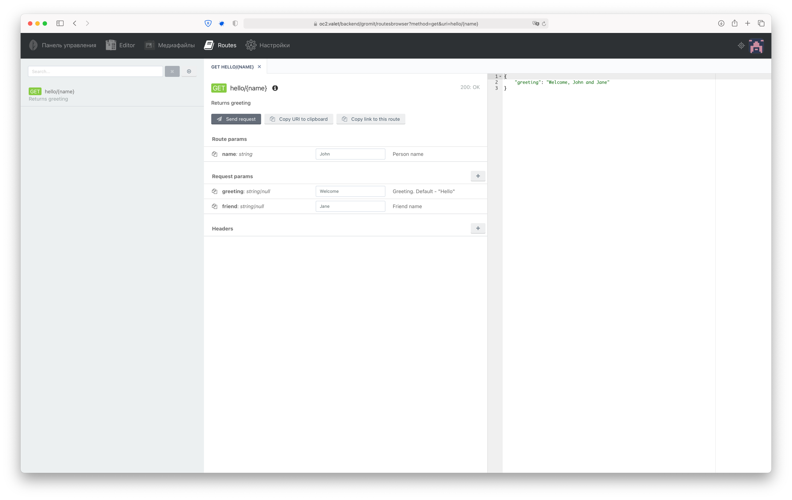

# GromIT.RouteBrowser

GromIT.RouteBrowser is the plugin for OctoberCMS helping backend developers to tell frontend friends about what routes
do they have in REST API.

It collects the info about routes from code and docblocks using reflections.

## Where info collects from

Every route have URI, method, action, request class, description, route parameters and request parameters.

`URI`, `method` and `action` are collected from Route facade, so you don't need to add anything to your code for show
this info in routes list.

```php
// Here we got route with: uri "hello/{name}", method "GET", action "Closure"
// and one route parameter with name "name" type "string"

Route::get('hello/{name}', function (string $name) {
    //
});
```

`Route parameters` names and types are collected from route itself, but route description and parameters descriptions
goes from route handler docblock.

Route parameters types from docblock overrides types from code.

```php
// Docblock for closure adds this info to route:
// description "Returns greeting" and route parameter description "Person name"

Route::get('hello/{name}',
    /**
     * Returns greeting
     * 
     * @param string $name Person name 
     */
    function (string $name) {
        //
    }
);

// OR

// Here route action will be "\Controllers\Namespace\GreetController@greet" 

Route::get('/hello/{name}', [GreetController::class, 'greet']);

class GreetController extends \Illuminate\Routing\Controller
{
    /**
     * Returns greeting
     * 
     * @param string $name Person name 
     */
    public function greet(string $name) {
        //        
    }
}
```

`Request class` and `request parameters` are collected from docblock of request class used in route handler.

```php
Route::get('/hello/{name}', [GreetController::class, 'greet']);

class GreetController extends \Illuminate\Routing\Controller
{
    /**
     * Returns greeting
     * 
     * @param string $name Person name 
     */
    public function greet(GreetRequest $request, string $name) {
        //        
    }
}

// These will add request class "\Requests\Namespace\GreetRequest" and request parameters:
// "greeting" with type "string|null" and description "Greeting. Default - "Hello""
// and "friend" with type "string|null" and description "Friend name".

/**
 * @property-read string|null $greeting Greeting. Default - "Hello"
 * @property-read string|null $friend   Friend name 
 */
class GreetRequest extends \Illuminate\Foundation\Http\FormRequest
{
    //
}
```

